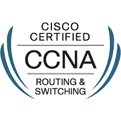

# Cisco-Networking-Academy

  * [Cisco Networking Academy](https://www.netacad.com/)
  * [Cisco Networking Academy Program - Wikipedia](https://it.wikipedia.org/wiki/Cisco_Networking_Academy_Program)

- Procure o site oficial da Cisco Networking Academy no Facebook© e no LinkedIn©. A página do Facebook é onde você pode encontrar e interagir com outros alunos da Networking Academy de diferentes partes do mundo. O site da Cisco Networking Academy no LinkedIn conecta você a anúncios de empregos e ainda é possível ver como os outros estão efetivamente comunicando suas habilidades.

## Cisco Packet Tracer
  * [Packet Tracer](https://www.netacad.com/courses/packet-tracer)
  
  About Packet Tracer
Cisco developed Packet Tracer to help Networking Academy students achieve the most optimal learning experience while gaining practical networking technology skills.

Packet Tracer is a powerful network simulation platform inspiring students to experiment with network behavior and ask 'what if' questions. It supplements physical equipment in the classroom by allowing students to create a network with an almost unlimited number of devices, encouraging practice, discovery and troubleshooting.

About Networking Academy: Started in 1997, Cisco Networking Academy is an IT & Networking skills and career building program for learning institutions and individuals worldwide.
  
## CCNA7
  - [ ] Capitulo 1
